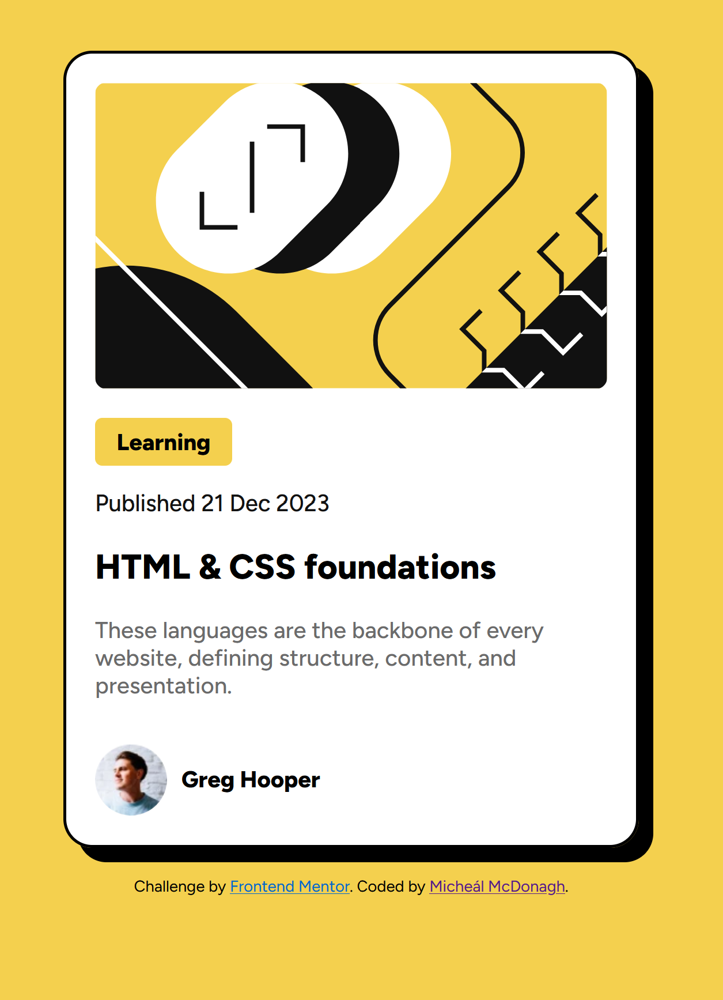

# Frontend Mentor - Blog Preview Card

This is my solution to the [Blog Preview Card challenge on Frontend Mentor](https://www.frontendmentor.io/challenges/blog-preview-card-ckPaj01IcS). Frontend Mentor challenges help you improve your coding skills by building realistic projects.

## Welcome! 👋

Thanks for checking out this front-end coding challenge.

## Table of Contents
- [Overview](#overview)
  - [The Challenge](#the-challenge)
  - [Screenshot](#screenshot)
  - [Links](#links)
- [My Process](#my-process)
  - [Built With](#built-with)
  - [What I Learned](#what-i-learned)
  - [Continued Development](#continued-development)
  - [Useful Resources](#useful-resources)
- [Author](#author)
- [Acknowledgments](#acknowledgments)

## Overview

**To do this challenge, you need a basic understanding of HTML and CSS.**

### The Challenge

Your challenge is to build out this blog preview card and get it looking as close to the design as possible. Users should be able to:
- See hover and focus states for all interactive elements on the page.

You can use any tools you like to help you complete the challenge. So if you've got something you'd like to practice, feel free to give it a go.

### Screenshot

### Links

Want some support on the challenge? [Join our community](https://www.frontendmentor.io/community) and ask questions in the **#help** channel.
- Solution URL: [Blog Preview Card Solution](https://github.com/michealmcdon/blog-preview-card)
- Live Site URL: [Live Site on Vercel](https://blog-preview-card-mrbm.vercel.app/)

## My Process

Your task is to build out the project to the designs inside the `/design` folder. You will find both a mobile and a desktop version of the design.

### Built With
- Semantic HTML5 markup
- CSS custom properties
- Flexbox
- CSS Grid
- Mobile-first workflow

### What I Learned
Throughout this project, I learned how to effectively use CSS Grid and Flexbox to create responsive layouts. I found it useful to adjust card elements to ensure they scale well on different devices.

### Continued Development
In future projects, I want to focus on improving my understanding of advanced CSS techniques and JavaScript for dynamic content manipulation. I also plan to explore accessibility best practices more thoroughly.

### Useful Resources
Feel free to use any workflow that you feel comfortable with. Below are some suggested resources:
- [CSS Tricks: A Complete Guide to Flexbox](https://css-tricks.com/snippets/css/a-guide-to-flexbox/) - This resource helped me understand how to implement Flexbox layouts effectively.
- [MDN Web Docs: CSS Grid](https://developer.mozilla.org/en-US/docs/Web/CSS/CSS_Grid_Layout) - A comprehensive guide that clarified many of the grid properties I used in this project.

## Author
- Frontend Mentor - [@michealmcdon](https://www.frontendmentor.io/profile/michealmcdon)

## Acknowledgments
A special thanks to the Frontend Mentor community for providing this challenge, which has helped me improve my front-end development skills. I appreciate the feedback and inspiration from fellow developers.
